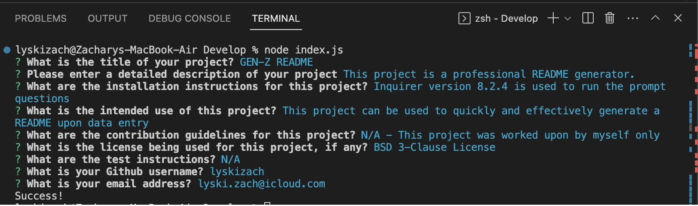

# GEN-Z README
  

  

  ## Table Of Contents
  - [Description] (#description)
  - [Installation] (#installation)
  - [Usage] (#usage)
  - [Licenses] (#licenses)
  - [Contribution] (#contribution)
  - [Testing] (#testing)
  - [Questions] (#questions)

  ## Description
  This project is a professional README generator.

  ## Installation
  Inquirer version 8.2.4 is used to run the prompt questions

  ## Usage
  This project can be used to quickly and effectively generate a README upon data entry

  ## Licenses
  
  This project is using a/an BSD 3-Clause License.
  Go to (https://opensource.org/licenses/BSD-3-Clause) to read more about this license.

  ## Contribution
  N/A - This project was worked upon by myself only

  ## Testing
  N/A

  ## Questions
  lyskizach
  My Github Profile: https://github.com/lyskizach
  For additional questions, contact me by email at: lyski.zach@icloud.com
  
